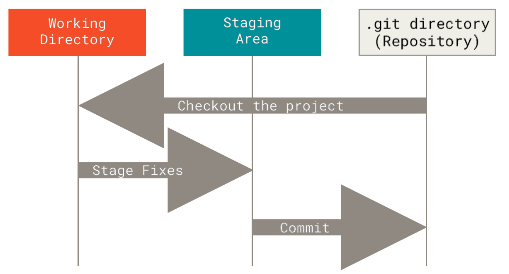
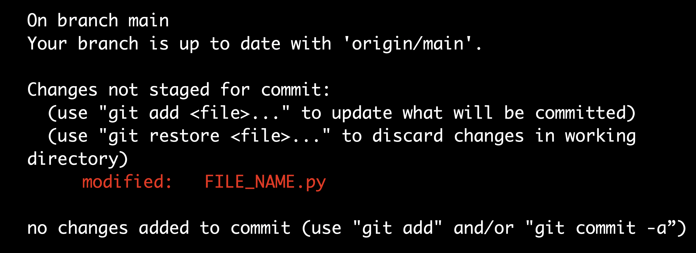
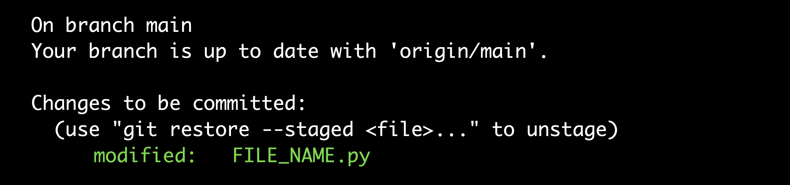
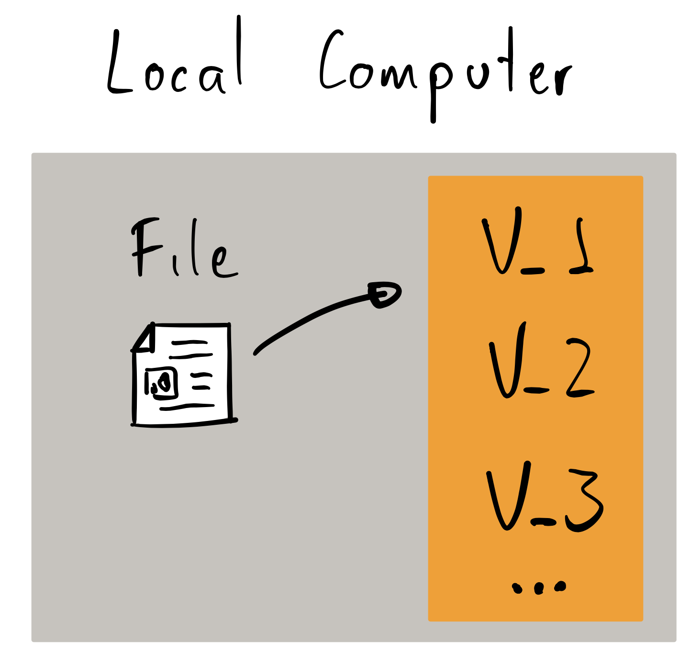
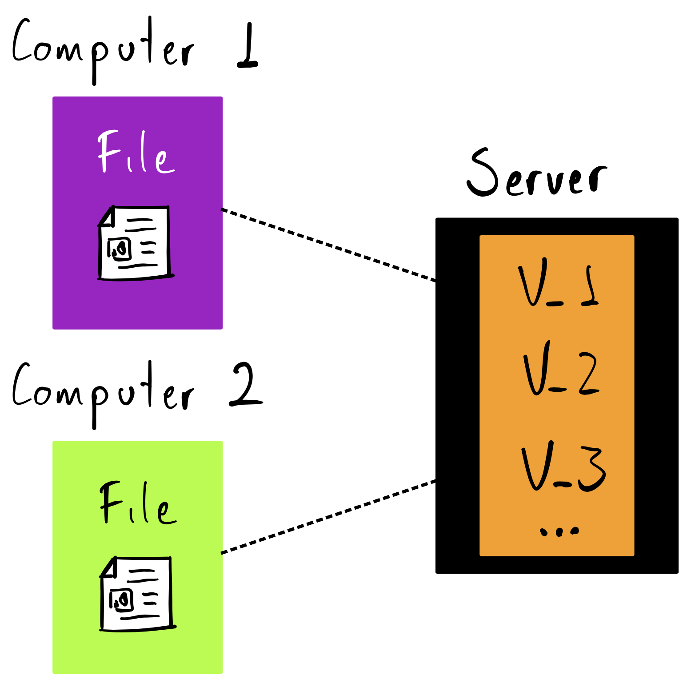
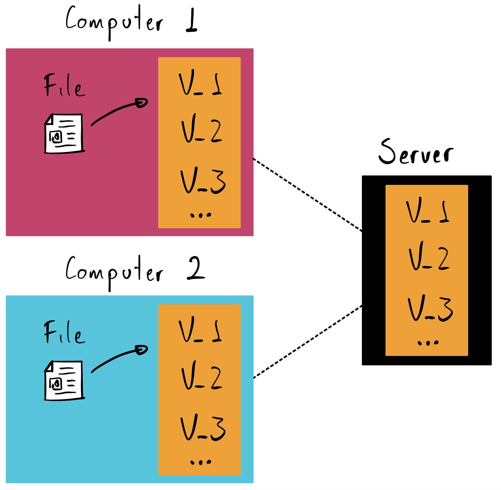

<h1 align="center">Git and GitHub</h1>

<p align="center">
  
</p>

## Table of Contents
- [Git](#git)
  - [Definition](#definition)
  - [Installation](#installation)
    - [macOS](#macos)
    - [Linux](#linux)
    - [Windows](#windows)
    - [Additional Configurations](#additional-configurations)
    - [Useful Configurations](#useful-configurations)
  - [Terminal commands](#terminal-commands)
    - [VIM](#vim)
  - [Git Stages](#git-stages)
  - [Git Commands](#git-commands)
    - [Create a Git repo](#create-a-git-repo)
    - [Check Status](#check-status)
    - [Add, Restore, rm and Commit](#add-restore-rm-and-commit)
    - [Git Log](#git-log)
    - [Git Tags](#git-tags)
    - [Git Show and Diff](#git-show-and-diff)
    - [Git Reset](#git-reset)
    - [Git Checkout](#git-checkout)
  - [Branching](#branching)
    - [Git Merge](#git-merge)
  - [Advanced Git Commands](#advanced-git-commands)
    - [Stash](#stash)
    - [Rebase](#rebase)
    - [Cherry Pick](#cherry-pick)
  - [Git-Ignore](#git-ignore)
  - [What is a VCS?](#what-is-a-vcs)
    - [Local](#local)
    - [Centralized](#centralized)
    - [Distributed](#distributed)
- [GitHub](#github)
  - [Remote Repositories](#remote-repositories)
  - [Generating a key](#generating-a-key)
  - [Push](#push)
    - [Force push](#force-push)
  - [Fetch and Pull](#fetch-and-pull)
  - [Issues and Pull-Request](#issues-and-pull-request)
  - [Other commands](#other-commands)
- [References](#references)

# Git

## Definition
Git is a [VCS](#vcs), usually used for coordinating work among programmers. Can be used with plain text, as well as binary files, but binary files may not be fully supported.

## Installation
You can check for the Git installation in terminal (or Git Bash in windows) typing:

```bash
git --version
```

### macOS
There are multiple options to install Git on a mac:
1. Download Git from [Official Git website](https://git-scm.com) and execute the installer.
2. **Using [homebrew](https://www.youtube.com/watch?v=1uvr9-zUB3w):** Type  `brew install git` in terminal.
3. **Using Xcode package:** When executing git from the terminal for the first time, it will ask you if you want to install it.

### Linux
Type in terminal `sudo apt-get install git`

It is recommended to update "apt-get" before any installation.

### Windows
Windows does not have a proper programming environment, so it needs to configure a lot or additional things such as a Bash terminal and security protocols.

1. Download Git from [Official Git website](https://git-scm.com)
2. Execute installer
3. **Components:**
   - Git Bash
   - TrueType (Beautiful text)
   - Check daily for Git updates
4. **Default branch name:** "master" (It's usually the default value)
5. **Default editor:** Vim is defualt, but VSCode is recommended
6. **PATH environment:** Git from command line and also from 3rd-party-software (more compatibility)
7. **HTTPS transport:** OpenSSL (Easy option)
8. **Line ending:** Checkout Windows and Commit Unix (more compatibility)
9. **Terminal emulator:** MinTTY (Useful to get used to linux commands)
10. **Behaviour of `git pull`:** Default (Ease of use)
11. **Credential helper:** Git Credential Manager
12. **Symbolic links:** Enable (Shortcuts but on Linux and macOS)
13. **System caching:** Enable (for Git to run faster)
14. **Experimental support:** No if not sure about it

### Additional Configurations
1. **Setup username:**
```bash
git config --global user.name "USERNAME"
```
2. **Setup email:**
```bash
git config --global user.email "EMAIL@DOMAIN.COM"
```

### Useful Configurations
- Set colorUI as true for colored visualization.
```bash
git config --global color.ui true
```
- Setup an [alias](https://git-scm.com/book/en/v2/Git-Basics-Git-Aliases) (**superlog**) for an easier and shorter log read.
```bash
git config --global alias.superlog "log --graph --abbrev-commit --date=relative --all --format=format:'%C(bold blue)%h%C(reset) %C(auto,magenta)%G? %C(bold green)(%>(18,trunc)%aD)%C(reset) %C(bold blue)[%<(10,trunc)%aN]%Creset - %s%C(reset) %C(bold yellow)%d%C(reset)'"
```
- To set an additional alias write the commands inside quotes as in the example below
```bash
git config --global alias.ALIAS_NAME "commands_in_alias"
```
- Set the default text editor for global or local (replacing `global` with `local`) use. Replace `code` with `atom` to use Atom, `subl` to use Sublime Text, etc.
```bash
git config --global core.editor “code —wait”
```
## Terminal commands
- Print working directory: It is used to find out where we currently are
```bash
pwd
```
- Change directory: It is used to change the current working directory (`~` stands for the user account's home folder)
- To exit a directory, use dots after `cd`
```bash
cd ~/documents/git/proyectX/
cd ..
```
- In macOS you can crag and drop a folder to the terminal to copy it's path

- List of items in directory (`-a` to see even hidden files, `-l` to see as a list)
```bash
ls -a
ls -l
```
- Make directory: Creates a folder un the current working directory
```bash
mkdir NEW_DIRECTORY_NAME
```
- Clear: Cleans the terminal but doesn't delete any commands given
```bash
clear
```
- Create files
```bash
touch FILE_NAME.EXTENSION
```
- Remove: It deletes a file or a folder
```bash
rm FILE_NAME.EXTENSION
rm -rf FOLDER_NAME
```
- View file content
```bash
cat FILE_NAME.EXTENSION
```

### VIM
VIM is the test editor of the terminal. To use it just type `vim` and then the file you want to open/edit.

Comment with `#`

To quit:
1. `esc` key
   - `:wq` To Write & quit
   - `:q!` To just quit
On windows:
- To quit, esc + shift + z + z (CMD and Terminal course :D)

## Git Stages
0. Untracked: Files added to a folder but not added
1. Working directory
2. Staging: Space in RAM (memory), temporal place for changes.
3. Repository: Final storage where commits go.

<p align="center">
  
</p>

## Git Commands

### Create a Git repo
To create a git repository, while located in the proyect folder, type
```bash
git init
```
It creates a hidden folder called `.git`, you can check that with the comand `ls -al`

To download a repository from an online service such as GitHub, there is the command `clone`
```bash
git clone REPOSITORY_LINK
```

### Check Status
```bash
git status
```
It shows if there are files staged or in the working directory. With this command, changes yet commited are listed.

- No changes (or all changes commited)
<p align="center">
  
</p>

- Changes in working directory
<p align="center">
  
</p>

- Changes staged
<p align="center">
  
</p>

### Add, Restore, rm and Commit
The `add` command is used to stage changes made in working directory
```bash
git add FILE_NAME       # Sends a specific change to the staging area
git add -all            # Stages all changes in a folder
```

The `restore` command removes changes from the staging area or working directory
```bash
git restore --staged FILENAME.py  # Removes FILENAME.py changes from the staging area
git restore FILENAME.py           # Removes FILENAME.py chenges from working directory
```

`rm` allows us to eliminate a file but without eliminating it's story in the repo. This is useful if later we want to get the file again.
```bash
git rm --cached   # Eliminates files from staging area but not working directory
git rm --force    # Eliminates files from staging area AND working directory
```

The `commit` command, is used to 'confirm' all changes already staged. It is a good practice to include a message with every commit, explaining the changes made.
```bash
git commit -m "MESSAGE" # Commits every staged change with a message
git commit --amend      # Changes current commit message
```

### Git Log
The `log` command, shows the commits made with some useful information such as:
1. [SHA](https://git-scm.com/book/en/v2/Git-Tools-Revision-Selection): Unique identifier, sequence or numbers and letters
2. Author of the commit
3. Date (including time)
4. Commit description message

<p align="center">
  
</p>

To use it, there are multiple posible parameters as shown below:
```bash
git log
git log --oneline       # Summary the whole commit in one line each
git log -5              # Limit the number of commits you want to see
git log -5 --graph      # Parameters can be nested
git log FILE_NAME       # Shows the commints in which the file was changed

git superlog            # An alias we previously created in "Useful Configurations" section
```

### Git Tags
Tags can point to a specific point in a repository's history. It is typically used to mark release points (`v1.0`, `v2.0`, etc.).

There are two types of tags:
1. **Lightweight:** Just a pointer to a specific commit
2. **Annotated:** It is checksummed (has a unique SHA). Carries other data, such as a message, tagger name, tagger email and date; and can be signed and verified with [GNU Privacy Guard](https://en.wikipedia.org/wiki/GNU_Privacy_Guard).
```bash
git tag TAG                 # TAG the current commit
git tag -a TAG              # Makes an annotated tag
git tag -a TAG -m "MESSAGE" # Creates TAG with a message
git tag TAG COMMIT_SHA      # Place TAG in a specifit commit

git tag -d TAG              # Deletes TAG

git tag --list              # Lists all tags
git tag -l                  # Same as above
git tag -l "v1.8*"          # Lists all tags containing "v1.8"
```
To detele a tag in a remote repo, we gotta `push` the changes (more about `push` command in the GitHub section)
```bash
git push -delete origin TAG_NAME
```

### Git Show and Diff
The `show` command generates a `diff` command between the last commit and the one before that. To use `diff`, we have to compare 2 different commits, using their SHA identifiers.

```bash
git show FILE_NAME

git diff SHA_1 SHA_2
```

### Git Reset
This allows us to go back to a specified version. It can be:
- **HARD:** Everything goes back
- **MIXED:** Discards the indicated commit, also removing those changes from staging area
- **SOFT:** We go back to an earlier verison, except for the staging area
```bash
git reset --hard SHA
git reset --soft SHA
git reset HEAD        #Eliminates files from staging but keeps them in working directory
```

### Git Checkout
The command `checkout` is used to place the computer in a version from the repository
```bash
git checkout SHA            # Places the computer in the commit associated with the given SHA
git checkout BRANCH         # Changes the branch of working directory
git checkout SHA FILENAME   # Reverts a file to how it was in the specified commit. 
                            # It becomes a change in working directory.
git checkout BRANCH FILENAME  # It takes a file to how it is in another branch
```

## Branching
A branch represents an independent line of development. New commits are recorded in the history for the current branch, which recults un a fork in the history of the proyect.

```bash
git branch                # Lists all branches in repo
git branch -l
git branch BRANCH_NAME    # Creates a new branch called BRANCH_NAME
git branch -d BRANCH      # Deletes the specified branch
git branch -D BRANCH      # Forse deletes a branch. Permanently throws away all commits associated with a branch
git push origin --delete BRANCH   # Deletes a remote branch. If we just delete, a remote repo may still have the locally deleted branch.
git branch -m BRANCH1     # Renames the current branch
git branch -m OLD_NAME NEW_NAME
git branch -a             # List all remote branches
```

### Git Merge
It is used to combine branches, usually with the master branch
```bash
git merge BRANCH_NAME   # Merges a specific branch with current branch
```

## Advanced Git Commands

### Stash

### Rebase

### Cherry Pick

## Git-Ignore
Create a hidden file calles `.gitignore`. Inside that file, every filename listed, means that file is gonna be ignored by git from now on. You can also ignore files with certain extension or even entire folders.
```bash
FOLDER_NAME/*       # Ignores every file inside a folder
*.code-workspace    # Ignores every file with an specific extension
``` 

## What is a VCS?
Register changes on a file or a set of files. It could work as a ctrl+z. You can "go back in time" but you have to save every change in order to do that.

This is better explained in the [Git Book](https://git-scm.com/book/en), section "1.1 About Version Control" (pag. 8)

With local and centralized systems, there's only one copy of the repository, so if that gets compromised... gg
### Local

<p align="center">
  
</p>

### Centralized

<p align="center">
  
</p>

### Distributed

<p align="center">
  
</p>

# GitHub

- Repository hosting
- Programmers social network
- Tasks and proyects can be managed from it

## Remote Repositories

## Generating a key
```bash
ssh-keygen -t rsa -b 4096 -C "email@domain.com"
cat ~/.ssh/id_rsa.pub | clip
```

## Push

### Force push

## Fetch and Pull

## Issues and Pull-Request

## Other commands
- Submodules: Are basically a repository inside a repository. You have to locate in the location you want the small repository to be in and type:
```bash
git submodule add REPO_LINK
```

# References
1. Platzi 
2. Wikipedia
3. Git Book [Link](https://git-scm.com/book/en)
4. Git Tower [Link](https://www.git-tower.com/learn/git/ebook/en/command-line/appendix/command-line-101/)
5. Git Official Book [Link](https://git-scm.com/book/en)
